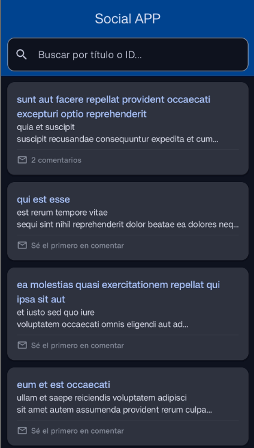
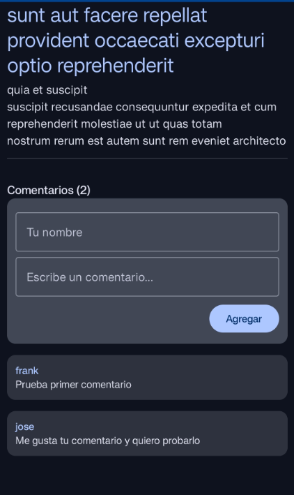

# social-on-off
Prueba técnica empresa ON/OFF

Aplicacion que lista post consumiento el api https://jsonplaceholder.typicode.com/posts y que permite agregar comentarios a dicho post seleccionado, guardando esta informacion en base de datos para visualizar nuevamente si se desea y no importa si se cierra la app ya que esta puede mantener la informacion incluso sin acceso a internet.

## Arquitectura
Se utilizo **Clean Arquitecture** junto con el patron de diseño **MVVM** y se dividio en las 3 capas que son:

## Estructura del proyecto
**Domain:** Logica de negocio y casos de uso
**Data:** consumo de api mediante retrofit, room y mappers para las diferentes respuestas de datos
**UI:** Se declararon las interfaces graficas para mostrar los post y comentarios que se agregen

## Librerias utilizadas y stack tecnoligo
**Kotlin:** Lenguaje principal
**Jetpack compose:** Diseño de UI
**Dagger hitl:** Inyeccion de dependencias
**Room:** Base de datos 
**Retrofit:** Consumo de Api
**Coroutine * flow:** Manejo asincrono de la informacio y datos en tiempo real

## Decisiones tecnicas
**OffLine first:** La app podra funcionar sin acceso a internet una vez se logre descargar por primera vez la informacion 
**SSOT (Single source of truth)** La UI esta encargada unicamente de observar la base de datos para el cambio de informacion
**Contador dinamico>** Los post de la pantalla principal muestra solo la cantidad de comentarios que tiene cada post mas no la informacion de estos, al abrir un post se mostrara completa la informacion del mismo junto con los comentario que este tiene

## Mejoras y escalabiliad de aplicacion
**Inicio de sesion:** Los usuarios deben poder hacer login y con esto ya no tendran que escribir su nombre al realizar un comentario
**Compartir post:** Poder realiazar mis propios post para que la comunidad pueda verlos
**Eliminar comentarios:** Poder eliminar los comentario ya se por que me equivoque o ya no quiero compartir mi opinion
**Buscador de usuario** Poder buscar usuarios especificos para ver sus post o comentarios compartidos
**Valoracion de post o comentario** Poder realizar una valoracion y mostrar en orden a esta en el feed
**Multi-plataforma:** Poder compartir con diferentes plataforma el uso de app
**Estilo:** Se debe definir un estilo personalizado y distintivo que sea agradable al usuario

## Ejecucion de proyecto
**Ejecucion:** Actualmente el proyecto solo se puede compilar para sistema operativo Android

## Evidencias de proyecto 

